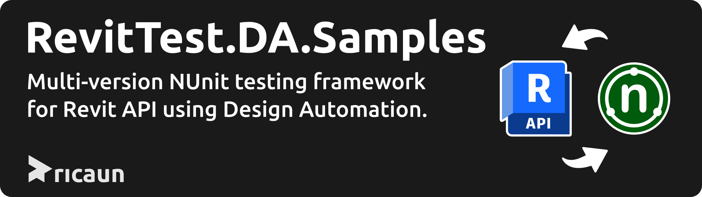

# RevitTest.DA.Samples

[](../..)
[](../..)
[](https://nuke.build/)
[](LICENSE)
[](../../actions)

[](https://github.com/ricaun-io/RevitTest.DA)

[ricaun.RevitTest](https://github.com/ricaun-io/ricaun.RevitTest) is a multi-version NUnit testing framework for Revit API.

**This project contain samples and the basic info about the [ricaun.RevitTest](https://github.com/ricaun-io/ricaun.RevitTest) Framework using Design Automation.**

## TestAdapter Configuration

To force the [ricaun.RevitTest.TestAdapter](https://github.com/ricaun-io/ricaun.RevitTest) to use the Design Automation for Revit to run test the environment variable `RICAUN_REVITTEST_TESTADAPTER_NUNIT_APPLICATION` could be used to set the path to the `ricaun.RevitTest.DA.Console` application.
```xml
RICAUN_REVITTEST_TESTADAPTER_NUNIT_APPLICATION=https://github.com/ricaun-io/ricaun.RevitTest.DA/releases/latest/download/ricaun.RevitTest.DA.Console.zip
```

There are other ways to change the `NUnit.Application` in the TestAdapter, check the [Wiki](https://github.com/ricaun-io/ricaun.RevitTest/wiki/Configurations) for more information.

## ricaun.RevitTest.DA

The `ricaun.RevitTest.DA` is a console application that can be used to run the tests in the Design Automation for Revit environment.

The environment variable `APS_CLIENT_ID` and `APS_CLIENT_SECRET` need to be set to run the tests in the Design Automation for Revit environment.
```xml
APS_CLIENT_ID=<your client id>
APS_CLIENT_SECRET=<your client secret>
```

To create a new application in the Autodesk Platform Service, check the [Autodesk](https://aps.autodesk.com/) website. The application needs to have API Access to `Design Automation API` and `Data Management API`.

For more information about the `ricaun.RevitTest.DA` check the [ricaun.RevitTest.DA](https://github.com/ricaun-io/ricaun.RevitTest.DA).

## dotnet test

The following command will run the tests and generate the results in the `TestResults` folder.

```
dotnet test .\RevitTest.DA\RevitTest.DA.csproj --configuration Release --logger trx --results-directory .\RevitTest.DA\bin\TestResults --verbosity Normal
```

## License

This project is [licensed](LICENSE) under the [MIT License](https://en.wikipedia.org/wiki/MIT_License).

---

Do you like this project? Please [star this project on GitHub](../../stargazers)!